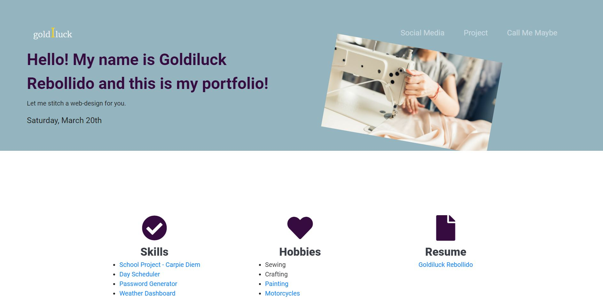
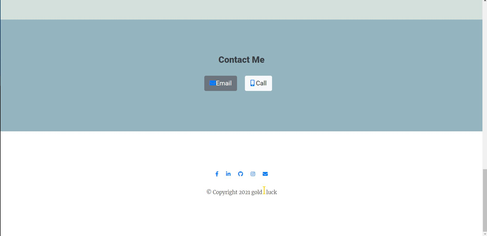

# potential-portfolio

An updated version of my Portfolio with added javascript, resume, and link to github and linkden, and other social media interaction.

## Preview

[
(https://drive.google.com/file/d/12hRnQ5WOSSqcFnXii_vVqHL7omXH8LYV/view "portfolio")

## Preview Images

## Future Improvements

Need to improve my README file.
Need to learn and improve screencastify

## Future Future Improvements

There are alot to work on with and i will adjust as a go along with the bootcamp. For now, click on the skills => School Project to see more of my skills.
